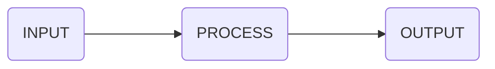

## Question 1

>[!tip] With the help of an appropriate diagram explain the main components of a computer?

The main components can be classified as **INPUT**, **PROCESS** and **OUTPUT**. Let break it down futher!

The **INPUT** components will include devices like:

- Keyboard and / or Mouse
- Graphics Tablet ( *Digitiser* )
- Gamepad / Steering Wheels ( *used to play video games* )

These *input* devices are used so that the user is able to **communicate** with the computer / system.

The **PROCESS** components will include:

- Central Processing Unit ( *CPU $\rightarrow$ The "brain" of the computer* )
- Random Access Memory ( *RAM $\rightarrow$ Holds the current operation / program that is being used or executed* )
- Graphics Card Unit ( *GPU $\rightarrow$ Used for graphics processing like in games or heavy illustration softwares* )

The *processing* components will take do perform arithmetic and logical operations in order to respond to the user's input through the *input* devices

The **OUTPUT** devices will consist of:

- Monitors / Computer Screens / Projectors
- Speakers / Headphones / Earphones
- Printers

These *output* devices will be able to show the user what has happened after the processing of their inputs. They will show the "*answer*" from the user's input

Other components include:

- Read Only Memory $\rightarrow$
	- Used to store the BIOS / Bootstrap ( *instructions* )
- Power Supply Unit
	- Used to *give* power to the whole system
- Coolers / AIOs
	- Used to cool down the CPU to prevent thermal throttling
	- So that it does not loose performance

### Diagram of Components of Computer

![[CPU - Memory - Input - Output.png | 450]]

### Inside the Central Processing Unit

![[CPU - ( ALU - CU - Registers ).png | 450]]

## Question 2

>[!tip] With the help of appropriate examples distinguish between volatile and non-volatile memory.

### Volatile Memory

This type of memory will **not** stay / persists when the computer is switched off!

Example of Volatile Memory: Random Access Memory ( RAM ) $\leftarrow$ part of processing components

- RAM will store the current operations / programs when the computer is switched on
	- When a program is called to be run, it called onto RAM and space is allocated to it
	- When execution of that program has finished, when the user closes it; it will be removed from *memory* ( RAM ) and *memory* will be freed

### Non-Volatile Memory

This type of memory **will** persists even when the computer is switched off!

Example of Non-Volatile Memory: Read Only Memory ( ROM )

- ROM will store the BIOS / Bootstrap Instructions

## Question 3

>[!tip] What is a compiler and what is its function?

A compiler is a software / program that will convert High Level Language ( *or high level code written by the programmer* $\Rightarrow$ Source Code ) and translates it into Machine Code where is can be understood by the computer and processes / executed by the CPU.

### Features of Compilers

- Converts the **whole** Source Code to Machine code all at once!
	- This means that the compiler uses a lot of computer resources like RAM and CPU
- Creates and executable program `.exe`
	- For example: if you write `C` code, `gcc` will convert the `main.c` file into `a.exe`
- Provides an Error List
- Examples of Compilers
	- gcc / g++
	- rustc
	- javac

## Question 4

>[!tip] Briefly explain the importance of the Java Virtual Machine ( JVM ).

When a programmer write a Java code ( *for example, the file is called `Main.java`* ) and compiles it.
Another file will be created ( *in this case `Main.class`* ); this new file is called **Bytecode**!

This *Bytecode* is run on the Java Virtual Machine. This means that whatever your system architecture is `x86` or `arm`. The Java Virtual Machine will be able to run any Java code on any computer that has the JVM installed.

This allows for programmers to write code once and can run anywhere ( WORA $\rightarrow$ Write Once, Run Anywhere ).

## Question 5

>[!tip] Name and describe with the help of suitable examples three types of errors that a program can contain.

- Syntax Error
	- Example
		- Instead of typing `printf()`; someone types `prntf()`
- Runtime Error
	- Example
		- Opening a file that is not present in path
		- Division by 0
- Logic Error
	- Example
		- If we need to calculate if `a` $\gt$ `b`; if `a` is **actually** $\gt$ `b`, but the programmer outputs:
			- `b is greater than a`

---

# Socials

- [**Instagram**](https://www.instagram.com/s.sunhaloo/)
- [**YouTube**](https://www.youtube.com/channel/UCMkQZsuW6eHMhdUObLPSpwg)
- [**GitHub**](https://www.github.com/Sunhaloo)

---

S.Sunhaloo
Thank You!